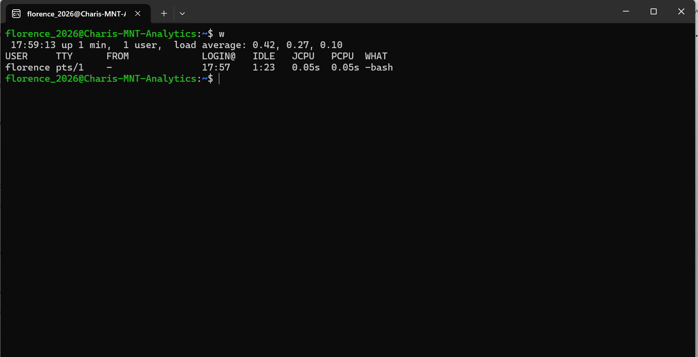
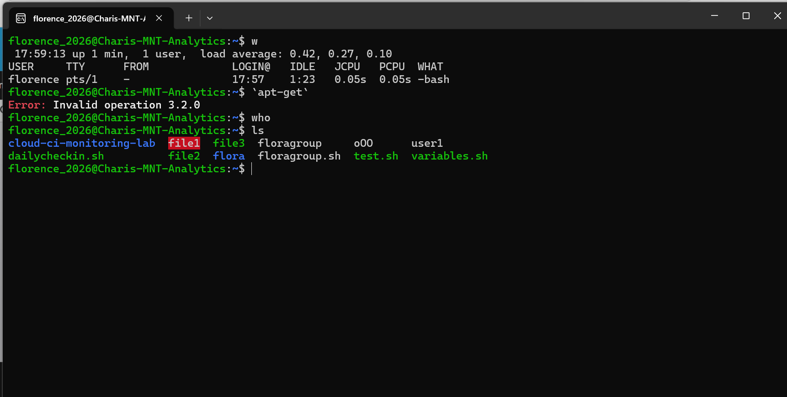

# Linux Essentials Weekly Learning Documentation

## Akwanya Hub Skill Pods Programme

This week, I studied the introductory modules of Linux Essentials and spent time understanding how Linux works as an operating system. My learning covered Linux fundamentals, operating systems, Linux distributions, the command line, applications, package management, security, cloud computing, and virtualization.

The sessions helped me understand that Linux is not only something used by system administrators. It supports servers, cloud platforms, embedded systems, software development, cybersecurity, and many other areas of computing.

## What I Learnt

### 1. Linux and the Linux Kernel

One of the most important concepts I learnt was the difference between Linux and a complete Linux operating system.

Linux itself is the kernel. The kernel acts as the central controller of the computer and manages important resources such as memory, hardware, applications, and processes.

A complete Linux system normally combines the Linux kernel with GNU tools, applications, and other utilities. This is why the term GNU/Linux is sometimes used.

### 2. Open Source Software

I also learnt that Linux is open source.

Open source means that the source code is available for people to examine, modify, and improve. This allows developers from different parts of the world to contribute to Linux and other open-source projects.

This helped me understand why Linux has developed into many different versions and why it is widely used in technology.

### 3. Linux Distributions

I learnt that a Linux distribution is a complete Linux operating system package.

Examples discussed during my study included:

* Ubuntu
* Debian
* Fedora
* Red Hat Enterprise Linux
* SUSE
* Linux Mint
* Android

Different distributions are designed for different purposes. Some focus on desktop users while others are designed for servers, enterprise environments, embedded devices, or specialised applications.

### 4. GUI and CLI

Another important area was the difference between the Graphical User Interface and the Command Line Interface.

A GUI allows users to interact with a computer through windows, menus, icons, and a mouse.

The CLI allows users to communicate directly with the operating system by entering commands into a terminal.

I learnt that Linux administrators use the command line extensively because it provides greater control and is useful for managing systems and automating tasks.

### 5. Terminal and Shell

I learnt that the terminal gives the user access to the command-line environment.

The shell receives the commands entered by the user, interprets them, and sends instructions to the operating system.

One of the most common Linux shells is Bash.

Understanding the difference between the terminal and the shell was important because I previously thought they referred to exactly the same thing.

## My Hands-On Practice

During my practical session, I used the Linux terminal to practise basic commands and become more comfortable working through the Command Line Interface.

This exercise helped me understand that Linux commands provide direct access to information about users, system activity, files, and software management.

### Screenshot 1: Using the `w` Command



In this exercise, I used the `w` command to check information about the users currently logged into the Linux system.

The command displayed information such as:

* Current system time
* System uptime
* Number of logged-in users
* System load average
* Username
* Terminal session
* Login time
* Idle time
* Current activity

From the output, I could see that the user `florence` was logged into the system and working through a Bash shell.

---

### Screenshot 2: Practising Linux Commands



In the second exercise, I practised the `apt-get`, `who`, and `ls` commands.

This helped me see how Linux responds to correctly entered commands as well as commands that require additional information.

---

## Commands I Used

### 1. `w`

```bash
w
```

The `w` command displays information about users currently logged into the Linux system and what they are doing.

When I ran the command, the system displayed information about my current session, including my username, login time, idle time, CPU activity, and system load.

This helped me understand how an administrator can quickly check who is using a Linux system.

---

### 2. `who`

```bash
who
```

The `who` command is used to display information about users who are currently logged into the system.

I learnt that this command is useful when an administrator wants to identify active users on a Linux machine.

In my practical session, the command returned to the prompt without displaying additional visible information. This also helped me understand that command output can depend on the Linux environment and session being used.

---

### 3. `ls`

```bash
ls
```

The `ls` command lists files and directories in the current working directory.

When I ran the command, I could see items such as:

```text
cloud-ci-monitoring-lab
dailycheckin.sh
file1
file2
file3
flora
floragroup
floragroup.sh
o00
test.sh
user1
variables.sh
```

This command helped me understand how to check the contents of a directory directly from the terminal instead of using a graphical file manager.

---

### 4. `apt-get`

```bash
apt-get
```

`apt-get` is a command-line package management tool associated with Debian-based Linux distributions such as Ubuntu.

It is used together with operations such as installing, updating, or removing software packages.

During my practical session, my first attempt produced the following error:

```text
Error: Invalid operation 3.2.0
```

This was useful because it showed me that Linux commands must follow the correct syntax and, in many cases, require an operation or additional argument.

For example, package-management commands usually follow a structure such as:

```bash
apt-get [operation] [package]
```

This practical experience helped me understand that errors are also part of learning Linux because the terminal gives feedback that can help identify what needs to be corrected.

---

## What I Learnt from the Commands

The practical exercise helped me understand that different Linux commands perform specific functions.

The `w` and `who` commands are related to users and login sessions, while `ls` helps users navigate and inspect files and directories.

I also learnt that package-management commands such as `apt-get` require the correct syntax and operation before Linux can perform the requested task.

The Linux Essentials material explains that `apt-get` is a front-end tool used to make Debian package management easier.

Another important lesson was that the Command Line Interface gives me more direct control over the operating system. Instead of clicking through menus, I can enter commands and immediately see the results.

---

## Challenges I Experienced

One challenge I experienced was remembering the correct structure of Linux commands.

For example, when I attempted to use `apt-get`, I received an error message. Instead of seeing the error as a failure, I learnt that Linux commands often require an action or additional argument.

This helped me understand the importance of command syntax.

Another challenge was learning how to interpret the output produced by commands such as `w`. At first, terms such as `TTY`, `IDLE`, `JCPU`, `PCPU`, and `load average` were unfamiliar to me.

By examining the output, I began to understand that Linux commands often provide detailed information that is useful for monitoring and administering a system.

---

## Key Takeaways from My Practical Session

My main takeaway from this practical exercise is that learning Linux requires practice.

Reading about commands helped me understand their purpose, but entering them myself helped me understand how the Linux terminal actually responds.

I learnt that:

* `w` displays logged-in users and their activities.
* `who` identifies users logged into the system.
* `ls` displays files and directories.
* `apt-get` is associated with software package management.
* Linux commands must follow the correct syntax.
* Error messages are useful when troubleshooting commands.
* The CLI provides a direct way of interacting with the Linux operating system.

This practical session increased my confidence in using the Linux terminal and gave me a foundation for learning more Linux commands.

## Acknowledgement

I appreciate the Akwanya Hub Skill Pods Programme for providing this learning opportunity and practical environment.

I also appreciate my team members for the discussions and support throughout the learning process.

This week's sessions have strengthened my understanding of Linux fundamentals and given me a good foundation for the next stage of the programme.
