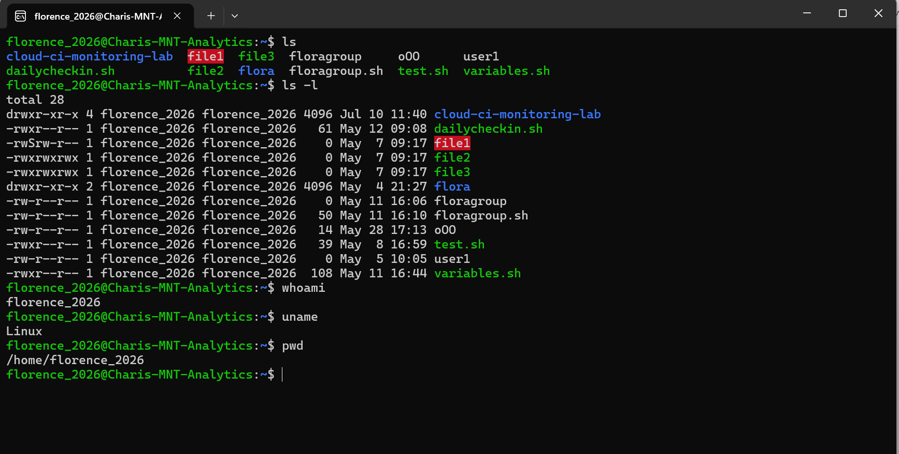
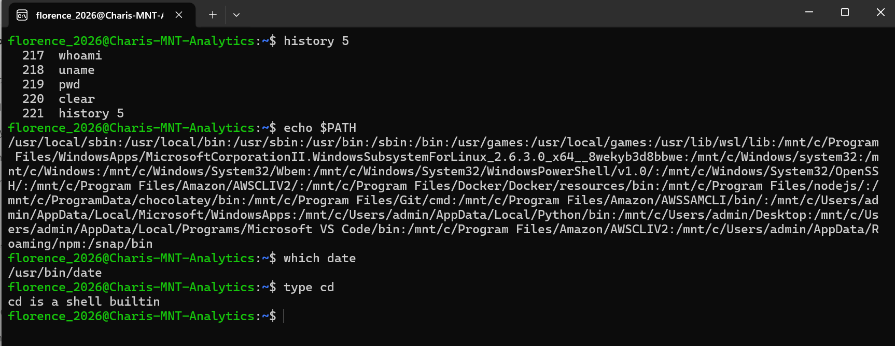

# Linux Essentials Week 2 Documentation

## Modules 4–6: Open Source Software, Command Line Skills and Getting Help

This week, I continued my Linux Essentials learning through the Akwanya Hub programme. My study focused on three main areas: open-source software, Linux command-line skills, and how to find help when working with Linux.

## What I Learnt

### Open Source Software

One of the major concepts I learnt was the meaning of open-source software.

Open-source software gives users access to the source code. This means that developers can study how the software works, make changes, identify problems, and contribute improvements.

I also learnt that open source does not necessarily mean that software has no commercial value. Companies can still make money by providing technical support, training, consulting, enterprise services, and other products around open-source software.

I was also introduced to software licensing concepts such as the GNU General Public License, the Free Software Foundation, the Open Source Initiative, FOSS, FLOSS, and Creative Commons licences.

### Command Line Skills

The second major area was working more confidently with the Linux Command Line Interface.

I learnt that the normal structure of a Linux command is:

```bash
command [options] [arguments]
```

The command tells Linux what action to perform, an option changes how the command works, and an argument tells the command what to act on.

I also learnt that Linux is case-sensitive, so commands and filenames must be entered correctly.

## My Hands-On Practice

### Screenshot 1: Basic Linux Commands



In this exercise, I practised basic Linux commands and observed the output produced by the system.

### Screenshot 2: Variables and Command History



This exercise helped me understand how Bash stores command history and environment information.

### Screenshot 3: Getting Help in Linux


Here, I practised some of the built-in Linux documentation and help tools.

## Commands I Used

### `ls`

```bash
ls
```

The `ls` command displays the files and directories in the current working directory.

### `ls -l`

```bash
ls -l
```

The `-l` option produces a long listing that gives more information about files and directories.

### `whoami`

```bash
whoami
```

The `whoami` command displays the username of the current user.

### `uname`

```bash
uname
```

The `uname` command displays information about the operating system or kernel.

### `pwd`

```bash
pwd
```

The `pwd` command means print working directory. It shows my current location within the Linux filesystem.

### `history 5`

```bash
history 5
```

This command displays the five most recent commands from the Bash command history.

### `echo $PATH`

```bash
echo $PATH
```

This displays the PATH environment variable. I learnt that PATH contains the directories Linux searches when trying to locate commands.

### `which date`

```bash
which date
```

The `which` command shows the location of an executable command. In this example, it shows where the `date` command is stored.

### `type cd`

```bash
type cd
```

The `type` command helps identify what type of Linux command is being used. `cd` is a shell built-in command.

## Getting Help in Linux

One of the most useful lessons from this module was that I do not have to memorise every Linux command.

Linux provides several built-in ways of finding help.

### `man date`

```bash
man date
```

The `man` command opens the manual page for another command. Manual pages provide information about a command's purpose, syntax, options, and usage.

### `date --help`

```bash
date --help
```

The `--help` option provides a quick summary of how a command can be used.

### `whereis passwd`

```bash
whereis passwd
```

The `whereis` command searches for commands and their related manual pages.

## Challenges

One challenge I experienced was remembering the correct syntax of different Linux commands.

Options, arguments, special characters, and command structures can initially appear confusing.

I also realised that some Linux commands produce a large amount of information, so understanding the output takes practice.

Learning to use the built-in help tools was therefore important because I can check the correct syntax instead of depending entirely on memory.

## Key Takeaways

My major takeaway from this week's study is that Linux becomes easier when I practise rather than only read about it.

I now understand that the command line is not simply about memorising commands. It is also about understanding how commands are structured and knowing how to find help when I get stuck.

I also gained a better understanding of why open-source software is important. It encourages collaboration, transparency, modification, and continuous improvement.

The `man`, `info`, and `--help` tools were particularly useful because they showed me that Linux already contains much of the documentation I need to continue learning independently.

I look forward to practising more commands and becoming increasingly confident working from the Linux terminal.
